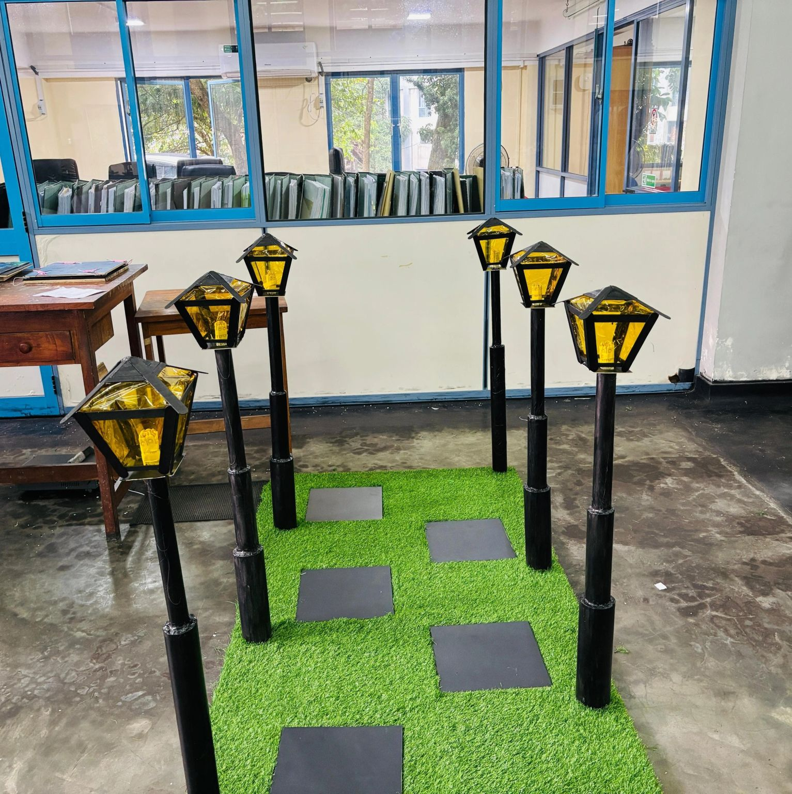
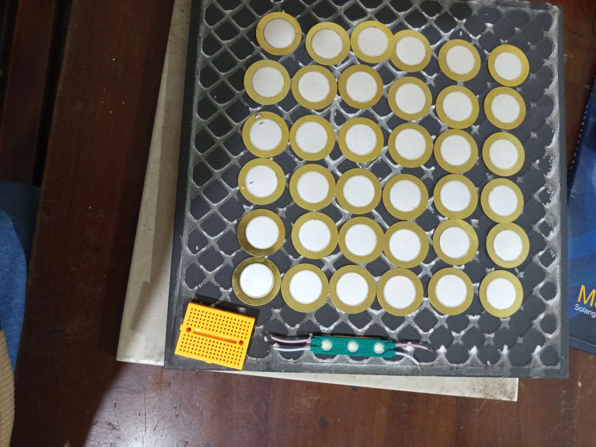
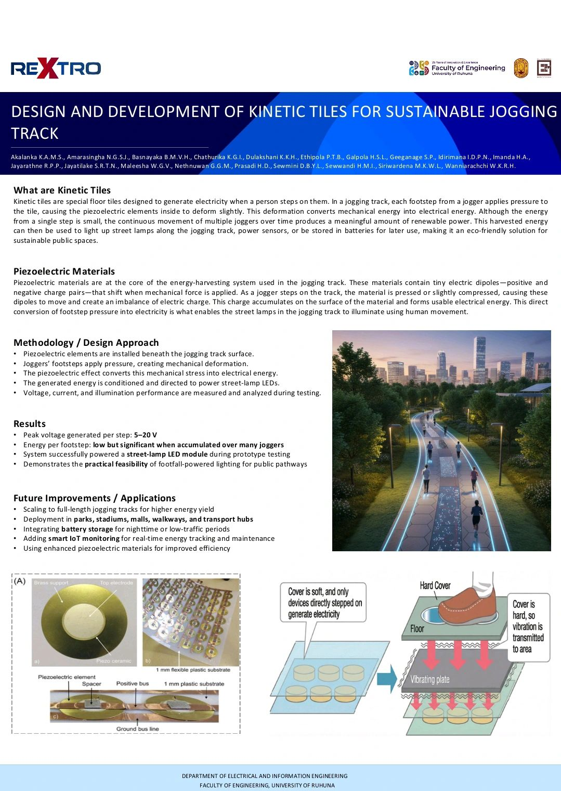

# Design and Development of Kinetic Tiles for Sustainable Jogging Track ⚡👣

This is a hardware-based electrical engineering team project focused on generating renewable energy using human motion. We designed and developed "Kinetic Tiles" to harvest energy from footsteps, successfully presented at the **ReXtro 2025 - Silver Jubilee Exhibition, University of Ruhuna**.

## 📖 What are Kinetic Tiles?
Kinetic tiles are special floor tiles designed to generate electricity when a person steps on them. In a jogging track, each footstep from a jogger applies pressure to the tile, causing the piezoelectric elements inside to deform slightly. This deformation converts mechanical energy into electrical energy. Although the energy from a single step is small, the continuous movement of multiple joggers over time produces a meaningful amount of renewable power. This harvested energy can then be used to light up street lamps along the jogging track, power sensors, or be stored in batteries for later use, making it an eco-friendly solution for sustainable public spaces.

## 🔋 Core Technology: Piezoelectric Materials
Piezoelectric materials are at the core of the energy-harvesting system. These materials contain tiny electric dipoles-positive and negative charge pairs-that shift when mechanical force is applied. As a jogger steps on the track, the material is pressed or slightly compressed, causing these dipoles to move and create an imbalance of electric charge. This charge accumulates on the surface of the material and forms usable electrical energy. This direct conversion of footstep pressure into electricity is what enables the street lamps in the jogging track to illuminate using human movement.

## 🛠️ Methodology & Design Approach
* Piezoelectric elements are installed beneath the jogging track surface.
* Joggers' footsteps apply pressure, creating mechanical deformation.
* The piezoelectric effect converts this mechanical stress into electrical energy.
* The generated energy is conditioned and directed to power street-lamp LEDs.
* Voltage, current, and illumination performance are measured and analyzed during testing.

## 📊 Results
* **Peak voltage generated per step:** 5–20 V
* **Energy per footstep:** low but significant when accumulated over many joggers.
* System successfully powered a **street-lamp LED module** during prototype testing.
* Demonstrates the **practical feasibility** of footfall-powered lighting for public pathways.

## 🚀 Future Improvements & Applications
* Scaling to full-length jogging tracks for higher energy yield.
* Deployment in **parks, stadiums, malls, walkways, and transport hubs**.
* Integrating **battery storage** for nighttime or low-traffic periods.
* Adding **smart IoT monitoring** for real-time energy tracking and maintenance.
* Using enhanced piezoelectric materials for improved efficiency.

## 📸 Project Gallery

### 1. Final Working Model
*(The completed jogging track model with kinetic tiles and illuminated street lamps)*

### 2. The Prototype & Wiring
*(Here we arranged the piezoelectric discs and wired them to capture the maximum voltage)*
 
 

### 3. Detailed Project Specifications

